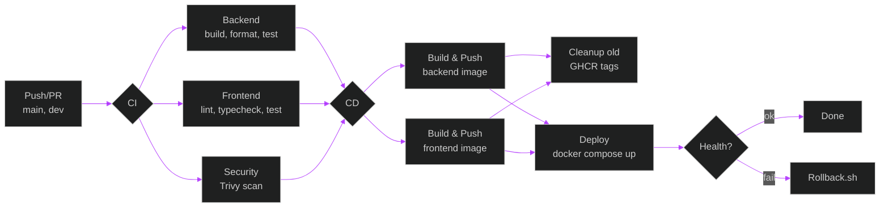

# CI/CD

## CI — `.github/workflows/ci.yml`

**Trigger:** PR/push to `main`, `master`, `dev`, `dev2`; manual dispatch (`run_integration_tests` toggle).  
**Concurrency:** `${{ github.workflow }}-${{ github.ref }}`, cancel in-progress.

- **Change detection:** `dorny/paths-filter@v3` — backend, frontend, docker.
- **Backend** (if changed or dispatch):
  - `.NET 9.0.x`, NuGet cache (`actions/cache@v4`)
  - Restore → Build (`Release`) → `dotnet format --verify-no-changes`
  - Unit tests: `dotnet test --filter "FullyQualifiedName~UnitTests"`
  - Integration tests: `dotnet test --filter "FullyQualifiedName~IntegrationTests"` (skippable via dispatch input)
  - Test env: `POSTGRES_CONNECTION_STRING`, `REDIS_CONNECTION_STRING`, `MONGODB_CONNECTION_STRING`, `JWT_KEY`, `JWT_ISSUER`, `JWT_AUDIENCE`, `EMAIL_ADDRESS`, `EMAIL_PASSWORD`, `EMAIL_NAME`
  - Services: Postgres 16, Redis 7 Alpine, MongoDB 7 (healthchecks)
  - Artifact: `tests/TestResults/`
- **Frontend** (if changed or dispatch):
  - Node 20, npm cache (`actions/setup-node@v4`)
  - `npm ci` → `npm run lint` (ESLint) → `npm run format:check` (Prettier) → `tsc --noEmit` → `npm run test` (Vitest)
  - Artifact: `frontend/coverage/`
- **Docker build test** (if changed or dispatch):
  - `docker/setup-buildx-action@v3`
  - Build backend & frontend images (`load: true`, no push)
  - Cache: `type=gha` (BuildKit cache export to GHA)
- **Security** (runs `if: always()` when backend or frontend succeeded):
  - Trivy filesystem scan (`aquasecurity/trivy-action@master`) for backend & frontend
  - Severity: `HIGH,CRITICAL`; format: `sarif`; `exit-code: 1`
  - Artifact: `trivy-*.sarif`

## Tests

### UnitTests (`tests/UnitTests.cs`)
- **PasswordHashingService** — hashing produces non-empty result; correct password verifies, wrong password fails.
- **JwtService** — token generation produces valid JWT with correct issuer, audience, subject, role claims; generated token passes validation with real key.
- **JwtSettings** — `FromConfiguration` throws `InvalidOperationException` when key/issuer/audience missing; `FromEnvironmentVariables` reads values correctly.

### IntegrationTests (`tests/IntegrationTests.cs`)
- **Infrastructure:** Testcontainers Postgres 16 (`shelter_test`); `AppDbContext` can connect, migrations apply cleanly, insert & query user.
- **Auth flow:** register persists user with hashed password; valid credentials produce a parseable JWT with correct claims; invalid credentials fail verification.
- **UserEmailService:** `FindByEmail` returns user; `EmailExists` returns true/false correctly.
- **Email configuration:** documents fallback behavior when SMTP env vars are absent.

## CD — `.github/workflows/cd.yml`

**Trigger:** `workflow_run` after CI succeeds on `master`, `dev`, `dev2`; manual dispatch (`deploy` toggle).  
**Concurrency:** `${{ github.workflow }}-${{ github.ref }}`, **no** cancel in-progress.

- **Version:**
  - `fetch-depth: 0` checkout
  - Short SHA, branch tag (`master` → `latest`, `dev2` → `dev`, else branch name)
  - Semantic version from last git tag + SHA (fallback `0.0.0-SHA`)
- **Build Backend:**
  - QEMU (`docker/setup-qemu-action@v3`) + Buildx
  - Login GHCR (`docker/login-action@v3`) via `GITHUB_TOKEN`
  - Metadata (`docker/metadata-action@v5`): tags = branch tag, version, short SHA
  - Build & push multi-platform (`linux/amd64`, `linux/arm64`) to `ghcr.io/${REPO}/backend`
  - BuildKit cache (`type=gha`)
  - SBOM: `anchore/sbom-action@v0` → `backend-sbom.spdx.json`
  - Attestation: `actions/attest-build-provenance@v1` (pushed to registry)
  - Artifact: `backend-sbom.spdx.json`
- **Build Frontend:** same flow for `ghcr.io/${REPO}/frontend` (Dockerfile: `frontend/docker/Dockerfile`)
- **Cleanup:**
  - `actions/delete-package-versions@v5`
  - Keeps 10 latest **untagged** versions for `smartanimalshelter/backend` and `smartanimalshelter/frontend`

## Legacy — `.github/workflows/docker-image.yml`

Push/PR to `master`. Simple `docker build ./backend` with SHA tag. **Redundant** with CI/CD.

## Dependabot — `.github/dependabot.yml`

Weekly grouped updates, target branch `dependabot-updates`, 1 open PR limit per ecosystem:
- **NuGet** (`/backend`)
- **npm** (`/frontend`)
- **Docker** (`/`, `/backend`, `/frontend/docker`)

## Deployment & Rollback

- **Prod:** `docker-compose.prod.yml` (Postgres 16, Mongo 6, Redis 7, backend, frontend)
- **Rollback:** `scripts/rollback.sh [tag]` — retags backup to `latest`, restarts compose, checks `/health`
- **Local:** `scripts/run.sh` — kills process on port 5000, `dotnet run`

## Notes

- CD pushes images to GHCR but **does not deploy** to the server automatically (no SSH/compose step).
- `docker-image.yml` should be removed to avoid duplication.
- Trivy `exit-code: 1` blocks CI on HIGH/CRITICAL vulnerabilities.

