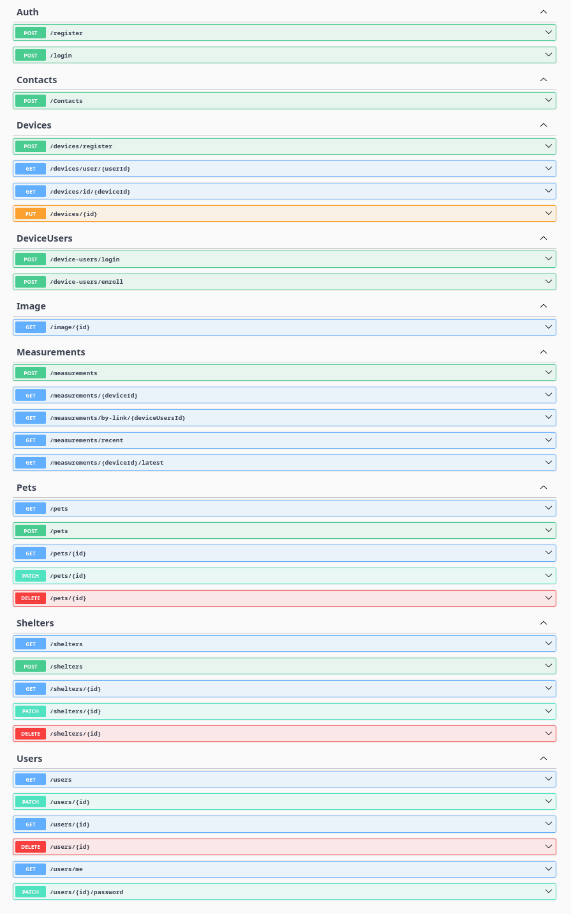

# Smart Shelter IoT | Integrated Animal Welfare & Environmental Monitoring System

**Smart Shelter IoT** is a comprehensive ecosystem designed to modernize animal shelter management. It combines operational management (pet accounting, adoption workflows) with an advanced **IoT environmental monitoring system** to ensure animal welfare. The platform also includes an e-commerce module for distributing monitoring hardware and a real-time communication channel between staff and adopters.

---

## About the Project

Traditional animal shelters often struggle with fragmented data and lack of control over environmental conditions in enclosures, which can lead to health issues among animals. **Smart Shelter IoT** solves this by integrating:

1.  **Shelter Management:** Centralized database for animals, staff, and adoption requests.
2.  **IoT Safety Net:** Real-time monitoring of **CO₂, Temperature, and Humidity** using sensors.
3.  **Communication:** Built-in real-time chat for adopters and shelter managers.
4.  **Commerce:** A store to purchase IoT stations, supporting shelter funding.

---

## Key Features

### Shelter Management
- **Animal Profiles:** Detailed records including medical history, photos, and status (Available, Adopted, Quarantine).
- **Auto-Parsing:** Integration with external platforms (e.g., ss.lv) to import lost/found pet data.
- **Role-Based Access Control (RBAC):** Admin, Veterinarian, Volunteer, Customer.
- **Adoption Workflow:** Application tracking and approval system.

### IoT Environmental Monitoring (SCD41)
- **High-Precision Sensors:** Uses **Sensirion SCD41** for accurate CO₂, Temperature, and Humidity readings.
- **Real-Time Dashboard:** Live visualization of enclosure conditions.
- **Smart Alerts:** Automated notifications to staff if CO₂ levels or temperature exceed safety thresholds.
- **Health Correlation:** Environmental history is linked to animal medical records for better veterinary diagnostics.

### Real-Time Chat
- **Direct Communication:** Secure chat between potential adopters and shelter staff.
- **Technology:** Powered by **SignalR** with **Redis Backplane** for scalability.
- **Context Aware:** Chats can be linked to specific adoption requests or orders.

### E-Commerce Module
- **Hardware Store:** Purchase IoT monitoring kits for home or other shelters.
- **Order Management:** Cart, checkout, and order status tracking.
- **Inventory System:** Real-time stock management.

---

### Data Strategy

| Database | Technology | Purpose |
|----------|------------|---------|
| **PostgreSQL** | Relational DB | Users, Animals, Orders, Chat Messages (ACID compliance). |
| **MongoDB** | Document DB | IoT Telemetry Logs (Time-series data, high write volume). |
| **Redis** | In-Memory DB | **Caching**, **Real-time Device State**, **SignalR Backplane**, **Rate Limiting**. |

### Entity Relationship Diagram (ERD)
The database schema is designed to link environmental data with animal welfare records.

*> Click to enlarge. Full schema available in `/docs/erd.sql`.*

---

## Technology Stack

| Component | Technologies |
|-----------|------------|
| **Backend** | ASP.NET, Entity Framework Core |
| **Frontend** | React Vite, TypeScript, TailwindCSS |
| **Real-Time** | SignalR, WebSockets |
| **Hardware** | ESP32-WROOM, Sensirion SCD41 (I2C) |
| **Databases** | PostgreSQL, MongoDB, Redis |
| **DevOps** | Docker, Docker Compose, Nginx |
| **Documentation** | Swagger UI, OpenAPI |

---

## Hardware Specification (IoT Node)

Each monitoring station is built using reliable, low-cost components suitable for shelter environments.

| Component | Model | Interface |
|-----------|-------|-----------|
| **Microcontroller** | ESP32-WROOM-32D | Wi-Fi |
| **Sensor** | Sensirion SCD41 | I2C (SDA) |
| **Power** | 5V USB / Li-Ion 18650 | VIN / GND |
| **Indicator** | 8 LED Ring, 1 Wifi LED| GPIO |

**Firmware Features:**
- **Deep Sleep Mode:** Extends battery life for wireless setups.
- **Auto-Calibration:** Forced Recalibration (FRC) for long-term accuracy.
- **Secure Transmission:** Data sent via HTTPS/MQTT with API Key authentication.

---
### Prerequisites
- **Docker & Docker Compose**
- **.NET 8 SDK** (for local development)
- **Node.js 18+** (for frontend)
- **Arduino IDE** (for firmware)

### System Architecture

The project follows a **Modular Monolith** architecture with **Polyglot Persistence** and **Defense-in-Depth** security strategy.

  
   
  <em> System architecture showing data flow, security zones, and CI/CD pipeline</em>

#### Architecture Components Breakdown

| Component | Technology | Purpose |
|-----------|------------|---------|
| **Users** | Web Browser | End users (adopters, shelter staff, volunteers) |
| **Cloudflare** | CDN / WAF | DDoS protection, SSL termination, content caching |
| **Nginx** | Reverse Proxy | Serves React static files, proxies API requests to Backend |
| **Backend .NET** | ASP.NET Core 8 | Main application logic, REST API, business rules |
| **MQTT Broker** | EMQX / Mosquitto | Async message broker for IoT device communication |
| **Device IoT** | ESP32 + SCD41 | Environmental sensors (CO₂, Temperature, Humidity) |
| **Redis** | In-Memory DB | Caching, session storage, rate limiting, real-time state |
| **MongoDB** | Document DB | IoT telemetry logs (time-series data), Images |
| **PostgreSQL** | Relational DB | Users, animals, orders, adoption requests (ACID compliance) |
| **Prometheus** | Monitoring | Collects metrics from all services |
| **Grafana** | Visualization | Dashboards and alerts for system health |
| **GitHub** | Version Control | Source code repository |
| **CI/CD Pipeline** | GitHub Actions | Automated build, test, and deployment |
| **Docker** | Containerization | Package and deploy all services |

#### Security Zones

| Zone | Components | Access |
|------|------------|--------|
| **Public Zone** | Users, Cloudflare, Device IoT | Open internet access |
| **Protected Zone** | Backend, All Databases, Prometheus, Grafana  | Internal network only, accessed via Nginx |

---

### Security Architecture

Security is implemented using a **Defense-in-Depth** strategy:

1.  **Perimeter Security:** Cloudflare WAF protects against DDoS and hides server IP.
2.  **Network Security:** 
    - **UFW Firewall:** Only ports 80/443 are open externally.
    - **Docker Network:** Databases (PostgreSQL, MongoDB, Redis) are isolated in an internal network, inaccessible from the public internet.
3.  **Application Security:** 
    - **JWT Authentication:** Secure access to API endpoints.
    - **Rate Limiting:** Redis-based throttling to prevent brute-force attacks.
    - **CORS Policies:** Restricting access to trusted domains only.

### API Documentation

  
   
  <em> System API documentation with Swagger implementation</em>

---
## Authors

- **Developer:** Alan Arzumanjan
- **Scientific Supervisor:** Vladislav Medvedev
- **School:** Professional High School "Victoria"

## License

This project is licensed under the **MIT License** - see the [LICENSE](LICENSE) file for details.
