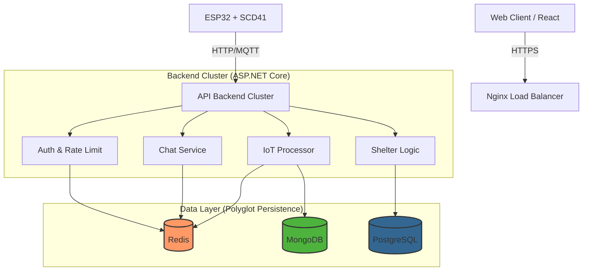
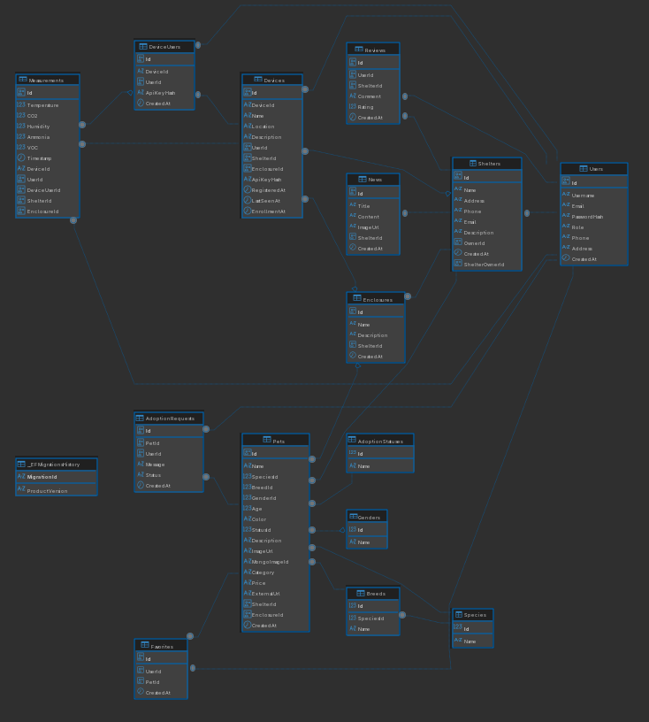

# 🐾 Smart Shelter IoT | Integrated Animal Welfare & Environmental Monitoring System

**Smart Shelter IoT** is a comprehensive ecosystem designed to modernize animal shelter management. It combines operational management (pet accounting, adoption workflows) with an advanced **IoT environmental monitoring system** to ensure animal welfare. The platform also includes an e-commerce module for distributing monitoring hardware and a real-time communication channel between staff and adopters.

---

## 📋 About the Project

Traditional animal shelters often struggle with fragmented data and lack of control over environmental conditions in enclosures, which can lead to health issues among animals. **Smart Shelter IoT** solves this by integrating:

1.  **Shelter Management:** Centralized database for animals, staff, and adoption requests.
2.  **IoT Safety Net:** Real-time monitoring of **CO₂, Temperature, and Humidity** using industrial-grade sensors.
3.  **Communication:** Built-in real-time chat for adopters and shelter managers.
4.  **Commerce:** A store to purchase IoT stations, supporting shelter funding.

---

## ✨ Key Features

### 🏠 Shelter Management
- **Animal Profiles:** Detailed records including medical history, photos, and status (Available, Adopted, Quarantine).
- **Auto-Parsing:** Integration with external platforms (e.g., ss.lv) to import lost/found pet data.
- **Role-Based Access Control (RBAC):** Admin, Veterinarian, Volunteer, Customer.
- **Adoption Workflow:** Application tracking and approval system.

### 🌡 IoT Environmental Monitoring (SCD41)
- **High-Precision Sensors:** Uses **Sensirion SCD41** for accurate CO₂, Temperature, and Humidity readings.
- **Real-Time Dashboard:** Live visualization of enclosure conditions.
- **Smart Alerts:** Automated notifications to staff if CO₂ levels or temperature exceed safety thresholds.
- **Health Correlation:** Environmental history is linked to animal medical records for better veterinary diagnostics.

### 💬 Real-Time Chat
- **Direct Communication:** Secure chat between potential adopters and shelter staff.
- **Technology:** Powered by **SignalR** with **Redis Backplane** for scalability.
- **Context Aware:** Chats can be linked to specific adoption requests or orders.

### 🛒 E-Commerce Module
- **Hardware Store:** Purchase IoT monitoring kits for home or other shelters.
- **Order Management:** Cart, checkout, and order status tracking.
- **Inventory System:** Real-time stock management.

---

## 🏗 System Architecture

The project follows a **Modular Monolith** architecture with **Polyglot Persistence** to optimize data storage and retrieval performance.



### 🗄 Data Strategy

| Database | Technology | Purpose |
|----------|------------|---------|
| **PostgreSQL** | Relational DB | Users, Animals, Orders, Chat Messages (ACID compliance). |
| **MongoDB** | Document DB | IoT Telemetry Logs (Time-series data, high write volume). |
| **Redis** | In-Memory DB | **Caching**, **Real-time Device State**, **SignalR Backplane**, **Rate Limiting**. |

### 🔴 Why Redis?
We utilize Redis to ensure high performance and scalability:
1.  **IoT Last Known State:** Instead of querying MongoDB for the current temperature, we store the latest value in Redis (`device:{id}:latest`). This makes dashboard loading instantaneous.
2.  **SignalR Backplane:** Enables seamless real-time chat even when multiple backend instances are running.
3.  **API Rate Limiting:** Protects authentication and chat endpoints from abuse using sliding window algorithms.
4.  **Distributed Caching:** Caches frequently accessed data (e.g., breed lists, product catalogs) to reduce PostgreSQL load.

### 🗄 Entity Relationship Diagram (ERD)
The database schema is designed to link environmental data with animal welfare records.


*> Click to enlarge. Full schema available in `/docs/erd.sql`.*

---

## 🛠 Technology Stack

| Component | Technologies |
|-----------|------------|
| **Backend** | ASP.NET, Entity Framework Core |
| **Frontend** | React Vite, TypeScript, TailwindCSS |
| **Real-Time** | SignalR, WebSockets |
| **Hardware** | ESP32-WROOM, Sensirion SCD41 (I2C) |
| **Databases** | PostgreSQL 15, MongoDB 6.0, Redis 7 |
| **DevOps** | Docker, Docker Compose, Nginx |
| **Documentation** | Swagger UI, OpenAPI |

---

## 🔌 Hardware Specification (IoT Node)

Each monitoring station is built using reliable, low-cost components suitable for shelter environments.

| Component | Model | Interface |
|-----------|-------|-----------|
| **Microcontroller** | ESP32-WROOM-32 | Wi-Fi |
| **Sensor** | Sensirion SCD41 | I2C (SDA) |
| **Power** | 5V USB / Li-Ion 18650 | VIN / GND |
| **Indicator** | WS2812B 8 LED Ring | GPIO |

**Firmware Features:**
- **Deep Sleep Mode:** Extends battery life for wireless setups.
- **Auto-Calibration:** Forced Recalibration (FRC) for long-term accuracy.
- **Secure Transmission:** Data sent via HTTPS/MQTT with API Key authentication.

---

## 🚀 Getting Started

### Prerequisites
- **Docker & Docker Compose**
- **.NET 8 SDK** (for local backend development)
- **Node.js 18+** (for frontend)
- **Arduino IDE** (for firmware)

---
### 🏗 System Architecture

The project follows a **Modular Monolith** architecture with **Polyglot Persistence**.

```mermaid
flowchart TD
    Client[Web Client / React] -->|HTTPS| LB[Nginx Load Balancer]
    IoT[ESP32 + SCD41] -->|HTTP/MQTT| API[API Backend Cluster]
    
    subgraph Backend["Backend Cluster (ASP.NET Core)"]
        API --> Auth[Auth & Rate Limit]
        API --> Shelter[Shelter Logic]
        API --> IoT_Core[IoT Processor]
        API --> Chat[Chat Service]
    end
    
    subgraph Data["Data Layer"]
        Auth --> Redis[(Redis)]
        Chat --> Redis
        IoT_Core --> Redis
        IoT_Core --> Mongo[(MongoDB)]
        Shelter --> PG[(PostgreSQL)]
    end
    
    style Redis fill:#f96,stroke:#333,stroke-width:2px,color:#000
    style Mongo fill:#4db33d,stroke:#333,stroke-width:2px,color:#fff
    style PG fill:#336791,stroke:#333,stroke-width:2px,color:#fff
    style Backend fill:#f9f9f9,stroke:#333,stroke-width:1px,stroke-dasharray: 5 5
    style Data fill:#f9f9f9,stroke:#333,stroke-width:1px,stroke-dasharray: 5 5
---

## 📈 Roadmap

- [ ] **Mobile Application:** Flutter app for volunteers on the go.
- [ ] **AI Analytics:** Predictive modeling for disease outbreaks based on climate data.
- [ ] **Home Assistant Integration:** Allow users to sync shelter data with their smart home.
- [ ] **Payment Gateway:** Integrate Stripe/PayPal for donations and shop purchases.

---

## 👥 Authors

- **Developer:** [Your Name] — Fullstack Developer & IoT Engineer
- **Scientific Supervisor:** [Supervisor Name] — [Title]
- **University:** [University Name]

## 📄 License

This project is licensed under the **MIT License** - see the [LICENSE](LICENSE) file for details.

---

### 📝 Note for Deployment
> For production deployment, ensure you change default passwords in `docker-compose.yml`, enable SSL via Nginx, and configure Redis persistence appropriately.