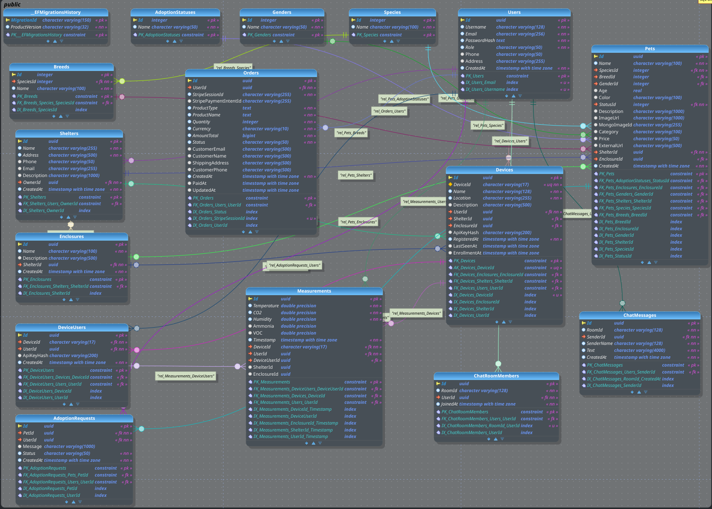
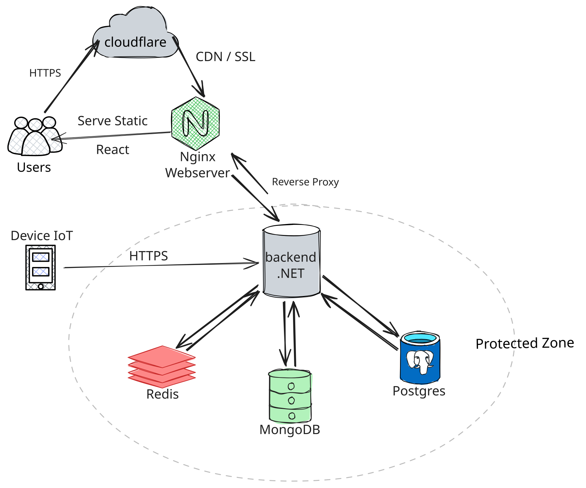
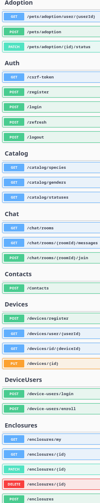
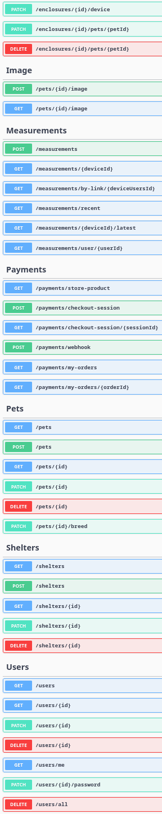
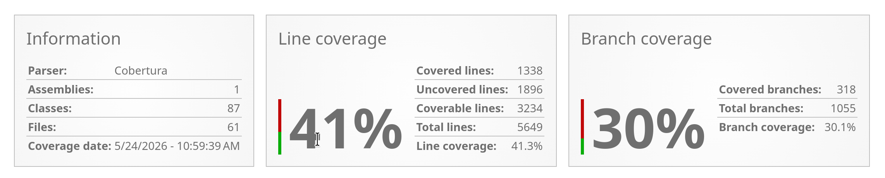
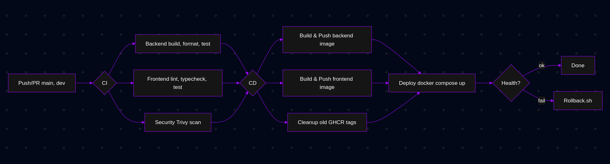

# Smart Shelter IoT | Integrated Animal Welfare & Environmental Monitoring System

**Smart Shelter IoT** is a comprehensive ecosystem designed to modernize animal shelter management. It combines operational management (pet accounting, adoption workflows) with an advanced **IoT environmental monitoring system** to ensure animal welfare. The platform also includes an e-commerce module for distributing monitoring hardware and a real-time communication channel between staff and adopters.

---

## About the Project

Traditional animal shelters often struggle with fragmented data and lack of control over environmental conditions in enclosures, which can lead to health issues among animals. **Smart Shelter IoT** solves this by integrating:

1.  **Shelter Management:** Centralized database for animals, staff, and adoption requests.
2.  **IoT Safety Net:** Real-time monitoring of **CO₂, Temperature, and Humidity** using sensors.
3.  **Communication:** Built-in real-time chat for adopters and shelter managers.

---

## Key Features

### Shelter Management
- **Animal Profiles:** Detailed records including medical history, photos, and status (Available, Adopted, Quarantine).
- **Role-Based Access Control (RBAC):** Admin, Shelter, Customer.

### IoT Environmental Monitoring (SCD41)
- **High-Precision Sensors:** Uses **Sensirion SCD41** for accurate CO₂, Temperature, and Humidity readings.
- **Real-Time Dashboard:** Live visualization of enclosure conditions.
- **Smart Alerts:** Automated notifications to staff if CO₂ levels or temperature exceed safety thresholds.
- **Health Correlation:** Environmental history is linked to animal medical records for better veterinary diagnostics.

### Real-Time Chat
- **Direct Communication:** Secure chat between potential adopters and shelter staff.
- **Technology:** Powered by **SignalR** with **Redis Backplane** for scalability.
- **Context Aware:** Chats can be linked to specific adoption requests or orders.

---

### Data Strategy

| Database | Technology | Purpose |
|----------|------------|---------|
| **PostgreSQL** | Relational DB | Users, Animals, Orders, Chat Messages (ACID compliance). |
| **MongoDB** | Document DB |  Images. |
| **Redis** | In-Memory DB | **Caching**, **SignalR Backplane**, **Rate Limiting**. |

### Entity Relationship Diagram (ERD)
The database schema is designed to link environmental data with animal welfare records.

  
   
  <em> Entity Relationship Diagram</em>

---

## Technology Stack

| Component | Technologies |
|-----------|------------|
| **Backend** | ASP.NET, Entity Framework Core |
| **Frontend** | React Vite, TypeScript, TailwindCSS |
| **Real-Time** | SignalR, WebSockets |
| **Hardware** | ESP32-WROOM, Sensirion SCD41 (I2C) |
| **Databases** | PostgreSQL, MongoDB, Redis |
| **DevOps** | Docker, Docker Compose, Nginx |
| **Documentation** | Swagger UI, OpenAPI |

---

## Hardware Specification (IoT Node)

Each monitoring station is built using reliable, low-cost components suitable for shelter environments.

| Component | Model | Interface |
|-----------|-------|-----------|
| **Microcontroller** | ESP32-WROOM-32D | Wi-Fi |
| **Sensor** | SCD41 | I2C (SDA) |
| **Indicator** | 8 LED Ring, 1 Wifi LED| GPIO |

**Firmware Features:**
- **Deep Sleep Mode:** Extends battery life for wireless setups.
- **Auto-Calibration:** Forced Recalibration (FRC) for long-term accuracy.
- **Secure Transmission:** Data sent via HTTPS/MQTT with API Key authentication.

---
### Prerequisites
- **Docker & Docker Compose**
- **.NET 8 SDK** (for local development)
- **Node.js 18+** (for frontend)
- **Arduino IDE** (for firmware)

### System Architecture

  
   
  <em> System architecture showing data flow, security zones, and CI/CD pipeline</em>

#### Architecture Components Breakdown

| Component | Technology | Purpose |
|-----------|------------|---------|
| **Users** | Web Browser | End users (adopters, shelter staff, volunteers) |
| **Cloudflare** | CDN / WAF | DDoS protection, SSL termination, content caching |
| **Nginx** | Reverse Proxy | Serves React static files, proxies API requests to Backend |
| **Backend .NET** | ASP.NET Core 8 | Main application logic, REST API, business rules |
| **Device IoT** | ESP32 + SCD41 | Environmental sensors (CO₂, Temperature, Humidity) |
| **Redis** | In-Memory DB | Caching, session storage, rate limiting|
| **MongoDB** | Images |
| **PostgreSQL** | Relational DB | Users, animals, orders, adoption requests (ACID compliance), Telemetry logs |
| **GitHub** | Version Control | Source code repository |
| **CI/CD Pipeline** | GitHub Actions | Automated build, test, and deployment |
| **Docker** | Containerization | Package and deploy all services |

#### Security Zones

| Zone | Components | Access |
|------|------------|--------|
| **Public Zone** | Users, Cloudflare, Device IoT | Open internet access |
| **Protected Zone** | Backend, All Databases | Internal network only, accessed via Nginx |

---

### Security Architecture (Defense-in-Depth)

Security is implemented across multiple layers to ensure data integrity and user privacy:
1. **Perimeter:** Cloudflare WAF blocks malicious traffic, Bots and DDoS attacks before they reach the server.
2. **Network:** Docker networks isolate databases. Only ports 80/443 are exposed externally via Nginx.
3. **Application:** 
   - JWT Authentication (15-minute lifespan) + HttpOnly Refresh Tokens.
   - Passwords hashed with `bcrypt` (≥10 rounds).
   - Strict CORS policies and Redis-based Rate Limiting to prevent brute-force attacks.
   - Protection against CSRF and XSS via Nginx security headers and antiforgery tokens.
4. **Data:** Sensitive user data (emails, phones) is encrypted at rest.

---

### API Documentation

<table>
  <tr>
    <td valign="top" align="center" style="padding: 10px;">
      
    </td>
    <td valign="top" align="center" style="padding: 10px;">
      
    </td>
  </tr>
</table>

  <em>System API documentation with Swagger implementation</em>

---

## Testing & Quality Assurance

  

The project adheres to modern software engineering practices with a robust, automated testing strategy integrated into the CI/CD pipeline.  
  - **Framework:** xUnit, `WebApplicationFactory` for API integration testing.  
  - **Isolation:** EF Core InMemory provider and a custom `FakeRedisService` ensure tests are fast, deterministic, and independent of external infrastructure.  
  - **Metrics:** 73 automated tests with a 100% pass rate (0 failures).  
  - **Coverage:** Critical modules achieve high coverage (e.g., `JwtService` at 100%, `UserEmailService` at 88.8%, `ShelterService` at 82.5%).

---

### CI/CD Piplines diagram

    
  <em> CI/CD Piplines diagram</em>

The project features a fully automated GitHub Actions pipeline:  
- **CI Phase:** On every PR/Push, the pipeline runs backend/frontend builds, linting, xUnit tests, and **Trivy** security scans (blocking on HIGH/CRITICAL vulnerabilities).  
- **CD Phase:** Upon success, multi-platform (`amd64`/`arm64`) Docker images are built and pushed to GitHub Container Registry (GHCR) with SBOM generation and build attestations.  
- **Resilience:** Includes an automated `rollback.sh` script to instantly revert to the previous stable version if health checks fail post-deployment.

---

## Authors

- **Developer:** Alans Arzumanjans
- **Scientific Supervisor:** Vladislavs Medvedevs
- **School:** Professional High School "Victoria"

## License

This project is licensed under the **MIT License** - see the [LICENSE](LICENSE) file for details.
