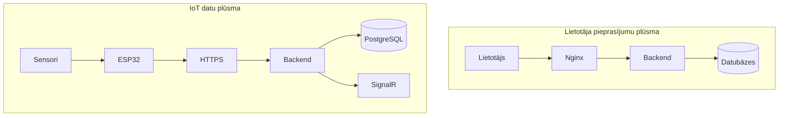

```mermaid
flowchart TD

subgraph UserFlow["Lietotāja pieprasījumu plūsma"]

A[Lietotājs]
B[Nginx]
C[Backend]
D[(Datubāzes)]

A-->B
B-->C
C-->D

end

subgraph IoTFlow["IoT datu plūsma"]

E[Sensori]
F[ESP32]
G[HTTPS]
H[Backend]
I[(PostgreSQL)]
J[SignalR]

E-->F
F-->G
G-->H
H-->I
H-->J

end
```